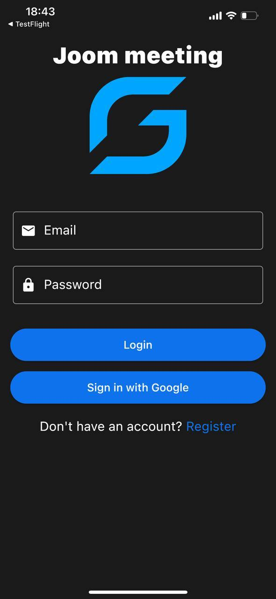
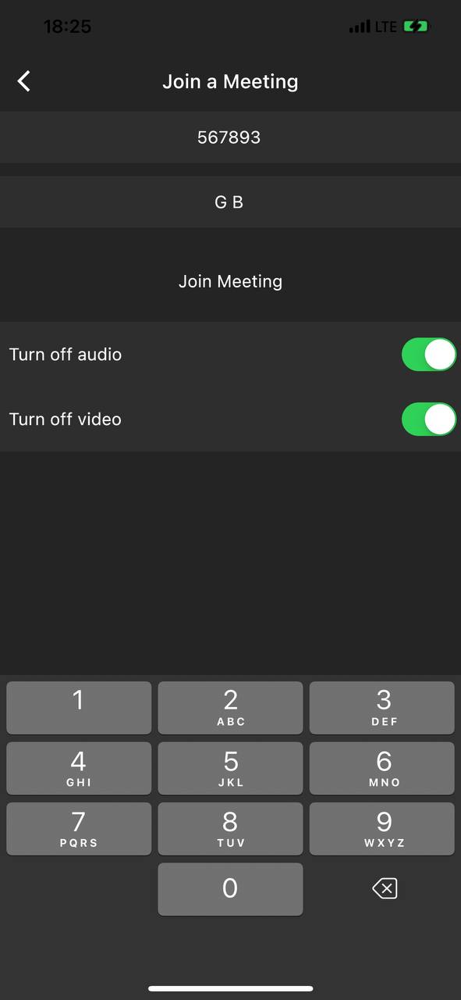
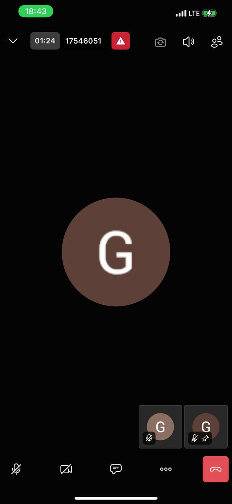
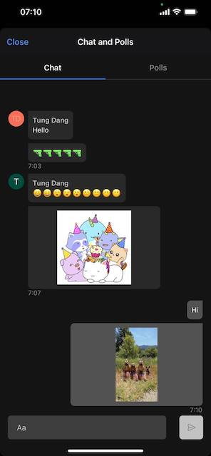
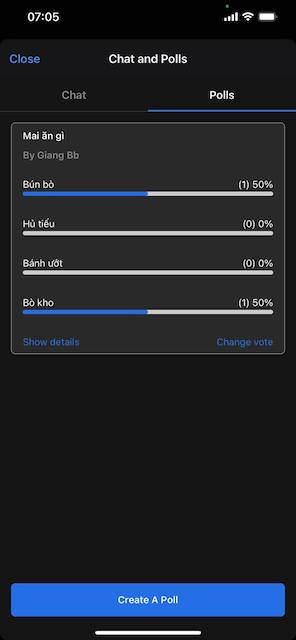

# [Giangbb Studio]

# Joom Meetings

A meeting app for Android/iOS

  
  
  
  
  
  

#

## Features

- FireStore
- Google Sign In
- Create New Meeting
- Join Meeting
- Mute/Unmute Audio
- Mute/Unmute Video
- Change Display Name while Joining
- Raise Hand
- Start Screen Sharing
- Mute Everyone
- Start Live Stream
- Screen Share
- Chat
- Switch Front/Rear Camera
- Picture in Picture
- Enter Tile View
- Disable Camera
- End Call
- See Your Meeting History
- Log out
